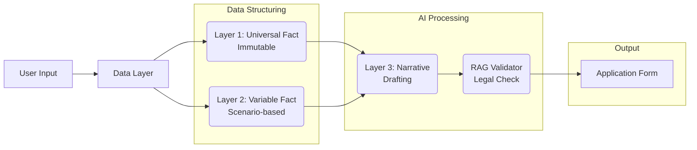

<div align="center">

# 🇰🇷 K-Stay
**Foreigner Visa Document Automation Platform**
<br/>
<em>"외국인의 복잡한 행정 서류, AI가 완벽하게 자동화합니다."</em>

<br/>


<br/>
<br/>

[🌐 Official Website ](https://k-stay.streamlit.app/) 

</div>

<br/>

## 📝 프로젝트 소개 (Overview)

**K-Stay**는 한국에 체류하는 외국인을 위한 **출입국 민원 서류 자동 생성 플랫폼**입니다.
복잡한 [별지 제34호 통합신청서 등의 서류]와 각종 사유서(구직활동계획서, 결혼배경진술서 등)를 하이코리아(HiKorea) 공식 양식에 맞춰 **자동 작성**하여 **ZIP 패키지**로 제공합니다.

### 🎯 Core Goals
* **One-Click Form**: 불변 정보(이름, 여권 등)는 가입 시 1회만 입력, 이후 모든 서류에 자동 매핑.
* **AI Active Validator**: 단순 입력이 아닌, AI가 "사유서"의 논리를 검토하고 "반려 위험 표현"을 능동적으로 교정.
* **Golden Six Scenarios**: 가장 수요가 높은 6가지 핵심 비자 시나리오(D-10, F-6 등) 완벽 대응.

<br/>

## 🏗 데이터 아키텍처 (Data Architecture)

K-Stay는 데이터의 성격에 따라 3계층(Layer)으로 분리하여 처리합니다.



| Layer | Type | Definition | AI Role |
| :--- | :--- | :--- | :--- |
| **Layer 1** | **Universal Fact** | 성명, 여권번호, 국적 등 평생 변하지 않는 **불변 정보** | ❌ (DB 매핑) |
| **Layer 2** | **Variable Fact** | 시나리오별(취업, 결혼 등) 달라지는 **상황 정보** | ❌ (Form 입력) |
| **Layer 3** | **Narrative** | 구직 계획, 초청 사유 등 설득이 필요한 **정성적 사연** | ✅ **Active Review** |

<br/>

## 🛠 기술 스택 (Tech Stack)

### Frontend & Application
* **Framework**: [Streamlit](https://streamlit.io/) (빠른 프로토타이핑 및 인터랙티브 웹앱 구현)
* **Language**: Python 3.9+

### Backend & Database
* **BaaS**: [Supabase](https://supabase.com/) (Auth, PostgreSQL, Storage)
* **User Data**: `users` (Universal Fact), `signatures` (서명 이미지)
* **Vector DB**: Pinecone / FAISS (법령 및 매뉴얼 RAG 검색용)

### AI & Logic
* **LLM**: OpenAI GPT-5 (Narrative 생성 및 검토)
* **Doc Processing**: `python-docx` (Word 템플릿 파싱 및 데이터 주입)
* **RAG Engine**: LangChain (하이코리아 매뉴얼, 출입국관리법 기반 질의응답)

### Payment
* **Gateway**: [Stripe](https://stripe.com/) (구독 및 단건 결제 처리, Webhook 연동)

<br/>


## 🗂 지원 시나리오 (Golden Six)

| Track | Scenario | Code | Key Documents (Auto-Generated) |
| :--- | :--- | :--- | :--- |
| **High Volume** | **구직 준비** | `D-10` | 구직활동계획서, 통합신청서, 거주숙소제공확인서 |
| | **아르바이트** | `Part-Time` | 시간제취업확인서, 요건준수확인서 |
| **High Margin** | **결혼 이민** | `F-6` | 결혼배경진술서, 배우자초청장 |
| | **가족 초청** | `F-1-5` | 가족초청장, 불법취업방지서약서 |
| **Recurring** | **전문 인력** | `E-7` | 고용사유서(필수성 증명), 사증발급인정신청서 |
| | **국적 귀화** | `Nat` | 귀화동기서, 귀화추천서 |

<br/>

## 🚀 빠른 시작

### 1. 저장소 클론
```bash
git clone https://github.com/your-username/kstay.git
cd kstay
```

### 2. 가상환경 설정
```bash
python -m venv venv
source venv/bin/activate  # Windows: venv\Scripts\activate
pip install -r requirements.txt
```

### 3. 환경 설정
```bash
mkdir -p .streamlit
cp .streamlit/secrets.toml.example .streamlit/secrets.toml
# secrets.toml 파일을 편집하여 API 키 입력
```

### 4. 실행
```bash
streamlit run app.py
```

---

## 📁 프로젝트 구조

```
kstay/
├── app.py                    # 메인 앱 엔트리 포인트
├── requirements.txt          # Python 의존성
├── .streamlit/
│   └── secrets.toml.example  # 시크릿 템플릿
│
├── config/
│   ├── __init__.py
│   └── settings.py           # 설정 및 시나리오 정의
│
├── services/
│   ├── __init__.py
│   ├── auth_service.py       # 인증 서비스 (Supabase)
│   ├── payment_service.py    # 결제 서비스 (Stripe)
│   ├── ai_service.py         # AI 서비스 (OpenAI)
│   └── document_service.py   # 문서 생성 서비스
│
├── pages/
│   ├── __init__.py
│   ├── login.py              # 로그인 페이지
│   ├── signup.py             # 회원가입 (Universal Fact)
│   ├── main_dashboard.py     # 메인 대시보드
│   ├── scenario_form.py      # 시나리오 폼 (Variable + Narrative)
│   ├── ai_chat.py            # AI 상담사
│   └── document_preview.py   # 문서 미리보기/다운로드
│
├── database/
│   └── schema.sql            # Supabase DB 스키마
│
├── templates/
│   └── mapping_guide.py      # 문서 매핑 가이드
│
└── rag_data/
    └── knowledge_base.py     # RAG 지식 베이스
```

---

## ⚙️ 설정 가이드

### Step 1: Supabase 설정

1. [Supabase](https://supabase.com)에서 새 프로젝트 생성
2. SQL Editor에서 `database/schema.sql` 실행
3. Project Settings > API에서 URL과 anon key 복사
4. `.streamlit/secrets.toml`에 입력:
```toml
SUPABASE_URL = "https://your-project.supabase.co"
SUPABASE_KEY = "your-anon-key"
```

### Step 2: OpenAI API 설정

1. [OpenAI Platform](https://platform.openai.com)에서 API 키 생성
2. `.streamlit/secrets.toml`에 입력:
```toml
OPENAI_API_KEY = "sk-your-api-key"
```

### Step 3: Stripe 결제 설정

1. [Stripe Dashboard](https://dashboard.stripe.com)에서 계정 생성
2. Products > Add Product로 $9.99 상품 생성
3. API Keys에서 Secret Key 복사
4. `.streamlit/secrets.toml`에 입력:
```toml
STRIPE_API_KEY = "sk_test_your-key"
STRIPE_PRICE_ID = "price_your-price-id"
STRIPE_SUCCESS_URL = "https://your-app.streamlit.app/?payment=success"
STRIPE_CANCEL_URL = "https://your-app.streamlit.app/?payment=cancel"
```

### Step 4: Word 템플릿 준비

1. [하이코리아](https://www.hikorea.go.kr)에서 공식 서식 다운로드
2. `.hwp` 파일을 `.docx`로 변환
3. `templates/` 폴더에 저장
4. `templates/mapping_guide.py` 참조하여 매핑 정의

---

## 🔧 개발 모드

개발 중에는 실제 API 연동 없이 목업 데이터로 테스트할 수 있습니다.

```python
# services/auth_service.py 등에서
# 실제 코드는 주석 처리되어 있고
# 개발용 목업 코드가 활성화되어 있습니다.
```

배포 시:
1. 각 서비스 파일에서 실제 API 연동 코드의 주석 해제
2. 개발용 목업 코드 주석 처리 또는 삭제

---

## 🚢 배포 (Streamlit Cloud)

1. GitHub에 코드 푸시
2. [Streamlit Cloud](https://streamlit.io/cloud)에서 새 앱 배포
3. Settings > Secrets에 모든 API 키 입력
4. Reboot 후 확인

---

## 🤝 기여하기

1. Fork the repository
2. Create your feature branch (`git checkout -b feature/AmazingFeature`)
3. Commit your changes (`git commit -m 'Add some AmazingFeature'`)
4. Push to the branch (`git push origin feature/AmazingFeature`)
5. Open a Pull Request

---

## 📄 라이선스

This project is licensed under the MIT License.

---

## 📞 문의

- 프로젝트 이슈: GitHub Issues
- 출입국 관련 공식 문의: 1345 (하이코리아)

---

**Made with ❤️ for foreigners in Korea**
